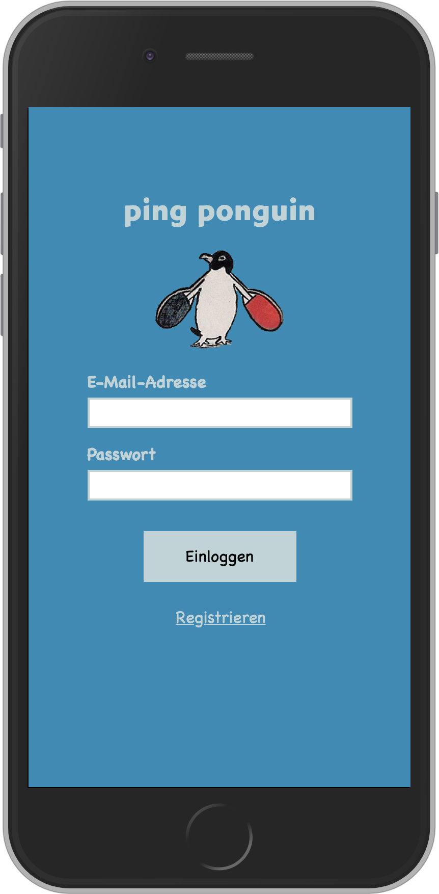
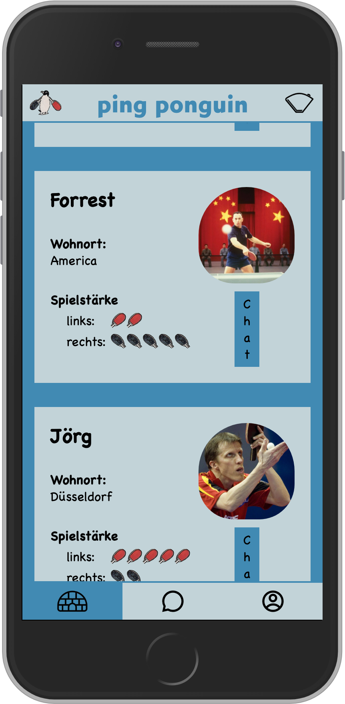
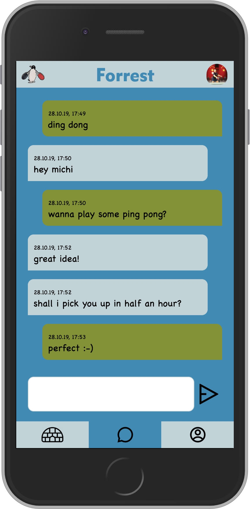

# ping ponguin


I developed **ping ponguin** as my final project during the [neuefische](https://www.neuefische.de) web developer bootcamp in fall 2019.

With ping ponguin you can find people to play ping pong with. You can sign up with your email. If you're signed in, you can see a list of the other registered players. The list can be filtered by residence and ability. If you want to play with someone you can start a chat.

## Preview

  

## Tech stack

The app was built using [create-react-app](https://create-react-app.dev/) and a MERN Stack:

- MongoDB
- Express
- React
- Node.js

The chat was built with [socket.io](https://socket.io/).

### Additional dependencies

- bcrypt
- cors
- mongoose
- prop-types
- react-router-dom
- react-scripts
- styled-components
- styled-icons
- use-socket.io-client

### Dev dependencies

- cypress
- eslint-plugin-cypress
- nodemon
- npm-run-all
- storybook
- storybook-react-router

## Usage

To run the app, you need to clone the project. Then run `npm install` in the project directory. And you need to setup a database, see [below](#mongo).

The app is build for mobile screens. Thus it appears in a 375 x 667 px frame on big screens.

### Main scripts

```
npm start
```

Runs the app in the development mode and the server with [nodemon](https://github.com/remy/nodemon).

Open http://localhost:3000 to view the app in the browser. The server runs on http://localhost:3333.

The page and the server will reload if you make edits.
You will also see any lint errors in the console.

```
npm run cypress
```

Opens [cypress](https://www.cypress.io/) for testing. Currently only a test for the sign in is implemented.

```
npm run storybook
```

Starts storybook. Currently only a small part of the app is in storybook.

### <a name="mongo"></a> MongoDB and mock data

You need to install MongoDB (or have it already installed) and it must be reachable under the default port [http://localhost:27017](http://localhost:27017).

You need to setup a database with name "ping-ponguin". You can then either sign up users in the app yourself or you can set up a collection with name "users" and import mock data.

You find mock data for users in _server/data/mockUsers.json_. You can import that file using a tool like [MongoDB Compass](https://www.mongodb.com/products/compass). You can then login with:

- email: pingu@coldmail.gl
- password: titanic

## Acknowledgements

Many Thanks

- to the awesome team of neuefische!!!
- to my fellow bootcampers!!!
- to [Yagya](https://yagya.bandcamp.com/) and Erik Satie (and many others) for making such great music to code to.
- to [Titanic-Magazin](https://www.titanic-magazin.de/) which I stole the ping ponguin logo from. (Please don't sue me!)

Shout outs to all [depressed penguins](https://www.youtube.com/watch?v=zWH_9VRWn8Y).
